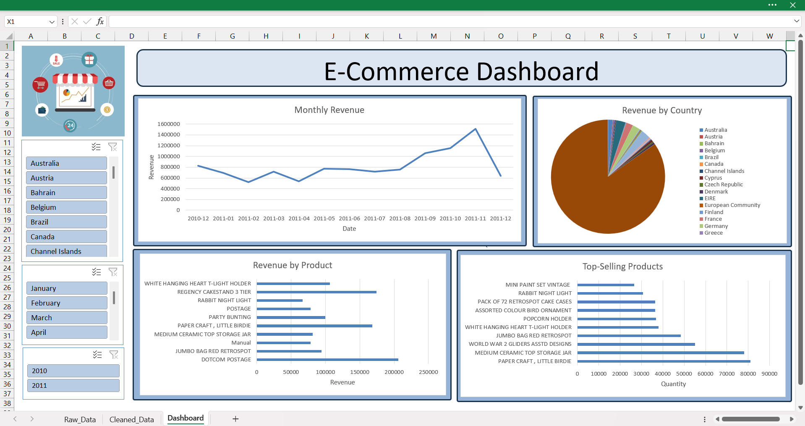

# 🛒 E-Commerce Sales Dashboard

## 📌 Project Overview

This project focuses on cleaning and analyzing an e-commerce sales dataset using **Python** and visualizing key performance indicators (KPIs) in an **interactive Excel dashboard**.

The dataset contains detailed information about online transactions, including order numbers, dates, products, quantities, and countries.

---

## 🧹 Data Cleaning & Preprocessing (Jupyter)

The raw dataset was first explored and cleaned using Python with `Pandas`, `Seaborn`, and `Matplotlib`. Here are the main steps:

- **Removed Cancelled Orders** (Invoice numbers starting with 'C')
- **Dropped rows with missing or invalid prices and quantities**
- **Kept rows with missing product descriptions or customer IDs** 
- **Removed fully duplicated rows**
- **Created a `TotalPrice` column** (`Quantity × UnitPrice`)
- **Filtered out rows where `UnitPrice` or `Quantity` ≤ 0**
- **Parsed date values** to make `Year`and `Month` columns from `YearMonth` column

---

## 📈 KPIs Calculated

- ✅ Total Revenue
- ✅ Total Number of Orders
- ✅ Average Order Value
- ✅ Total Quantity Sold
- ✅ Monthly Revenue Trends
- ✅ Top-Selling Products

---

## 📊 Excel Dashboard

The cleaned data was exported to Excel, where an interactive dashboard was created featuring:

- 📅 **Monthly Revenue Trend** (line chart)
- 🌍 **Revenue by Country** (pie chart with slicer)
- 🔝 **Top-Selling Products** (bar chart)
- 🧾 **Revenue by Product** (bar chart)
- 📌 **Slicers** for Year, Month, and Country

The dashboard layout was designed for clarity, interactivity, and ease of use. To maintain its structure and prevent accidental changes, the sheet is protected and of course, slicers remain fully usable for interactive filtering.

---

## 🖼️ Dashboard Preview

---

## 🛠️ Tools Used

- Python (Pandas, Seaborn, Matplotlib)
- Jupyter Notebook
- Microsoft Excel (PivotTables, Charts, Slicers)
- Git & GitHub

---

## 🚀 How to Use

### 📥 Download the Excel Dashboard

1. Visit the repository on GitHub.
2. Click on the file: **`E-Commerce_Data_Dashboard.xlsx`**.
3. Click the **Download** button in the top-right corner.
4. Open the downloaded Excel file to explore the fully interactive, protected dashboard.

> ℹ️ **Note:** The sheet is protected to maintain layout integrity, but slicers and filters remain fully functional.

---

## 📄 License

This project is released for educational and portfolio purposes.

---

## 🙋‍♀️ Questions or Feedback?

Feel free to [open an issue](https://github.com/janafarghal/E-Commerce-Excel-Dashboard/issues) or connect with me!

